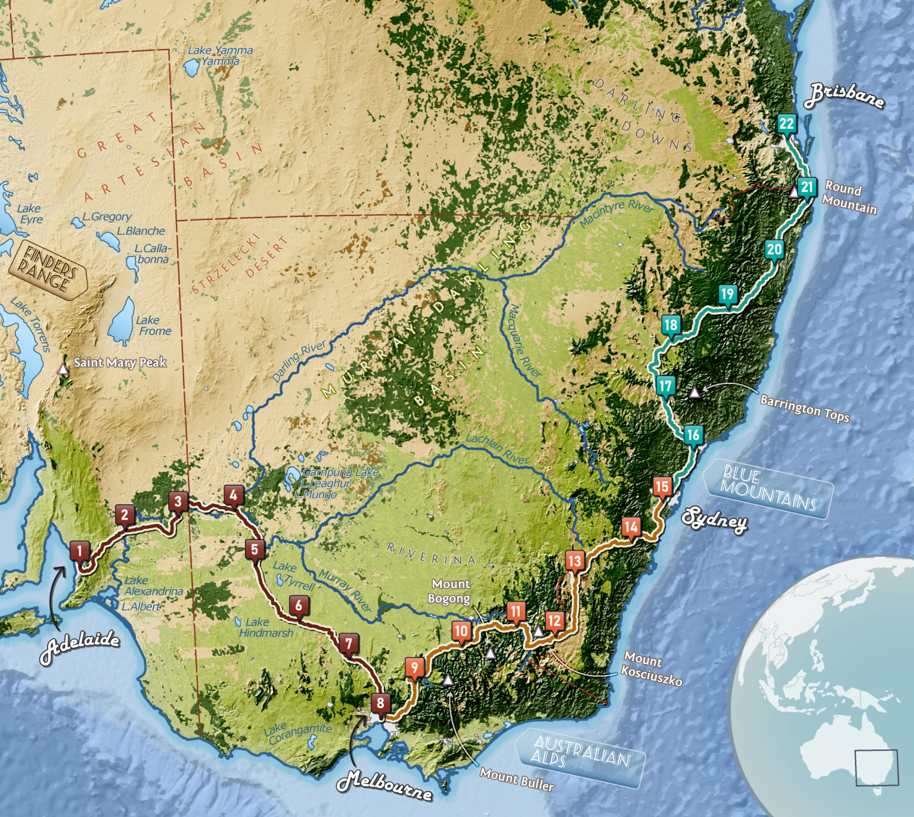

This project is for my UW-Madison Geog 572 Graphic Design in Cartography Class.

The raster image is one side of the project. The second side is a proposed companion graphic that gives names to the cities.

Skills: ESRI ArcGIS Pro, Adobe Illustrator, Adobe Photoshop, cartographic design, raster processing
