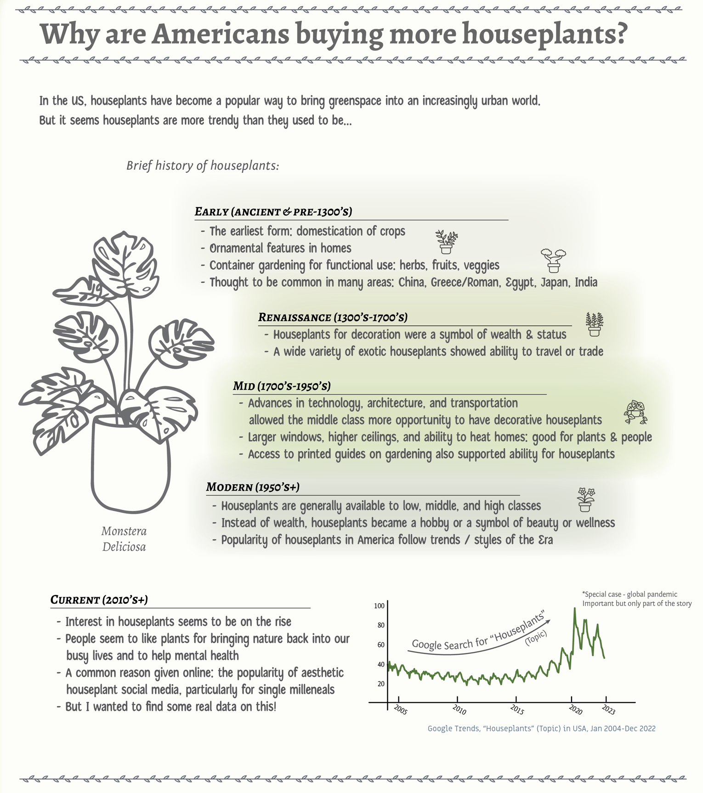
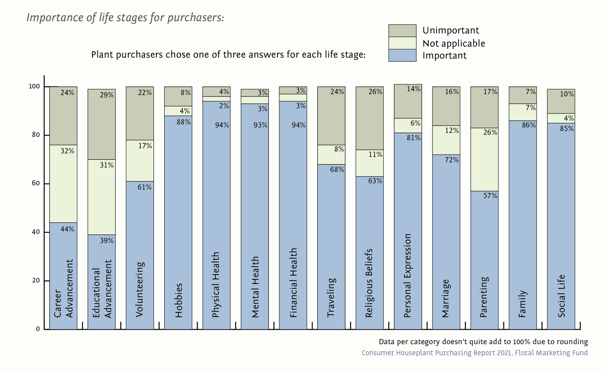
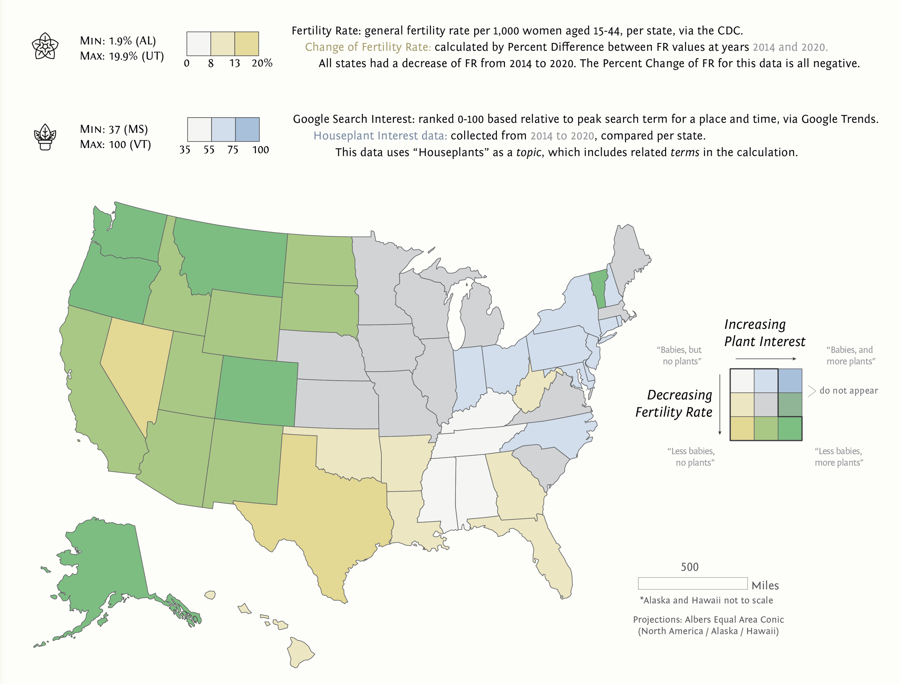

This project is my Lab 2 for UW-Madison Geog 572 Graphic Design in Cartography Class. The assignment was to greate an infographic with some spatial/map component. I'm proud of my illustrative work on this one, but I gave myself more work by including as much statistical information as I did. The choropleth map and bivariate analysis is where the bulk of the assignment was.

  The text in the above image reads: 
  <h2>Why are Americans buying more houseplants?</h2>
  
In the US, houseplants have become a popular way to bring greenspace into an increasingly urban world. But it seems houseplants are more trendy than they used to be...

  <h3>Early (Ancient & Pre-1300's)</h3>
  <ul>
    <li>The earliest form: domestication of crops</li>
    <li>Ornamental features in homes</li>
    <li>Container gardening for functional use: herbs, fruits, veggies</li>
    <li>Thought to be common in many areas: China, Greece/Roman, Egypt, Japan, India</li>
  </ul>
  <h3>Renaissance (1300's-1700's)</h3>
  <ul>
    <li>Houseplants for decoration were a symbol of wealth & status</li>
    <li>A wide variety of exotic houseplants showed ability to travel or trade</li>
  </ul>
  <h3>Mid (1700's-1950's)</h3>
  <ul>
    <li>Advances in technology, architecture, and transportation allowed the middle class more opportunity to have decorative houseplants</li>
    <li>Larger windows, higher ceiling, and ability to heat homes: goood for plants & people</li>
    <li>Access to printed guides on gardening also supported ability for houseplants</li>
  </ul>
  <h3>Modern (1950's+)</h3>
  <ul>
    <li>Houseplants are generally available to low, middle, and high classes</li>
    <li>Instead of wealth, houseplants became a hobby or a symbol of beauty or wellness</li>
    <li>Popularity of houseplants in America follow trends / styles of the Era</li>
  </ul>
  <h3>Modern (1950's+)</h3>
  <ul>
    <li>Houseplants are generally available to low, middle, and high classes</li>
    <li>Instead of wealth, houseplants became a hobby or a symbol of beauty or wellness</li>
    <li>Popularity of houseplants in America follow trends / styles of the Era</li>
  </ul>
  <h3>Current (2010's+)</h3>
  <ul>
    <li>Interest in houseplants seems to be on the rise</li>
    <li>People seem to like plants for bringing nature back into our busy lives and to help mental health</li>
    <li>A common reason given online: the popularity of aesthetic houseplant social media, particularly for single milleneals</li>
    <li>But I wanted to find some real data on this!</li>
  </ul>
  
This section of the infographic also includes a chart of Google Trends on the search for the topic "Houseplants" from 2005 to 2023, showing a small annual cycle of increases in the summer and decreases in the winter, and a much stronger upward trend from 2015 to 2021.

See the full size infographic <a href="/assets/572_houseplants-fullsize.png" target="_blank">here in a new page</a>

Skills: ESRI ArcGIS Pro, Adobe Illustrator, cartographic design, gathering data, data presentation, infographic design
