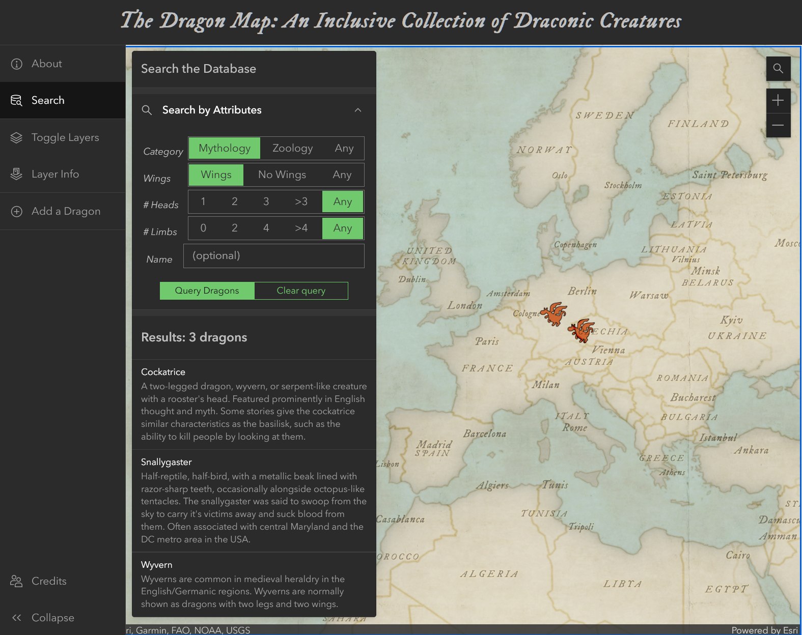

This project is my midterm for UW-Madison Geog 576 Class. My hope for this project is a database that would be improved by people sharing and adding more information. Dragons are so broad and have differences and similarities across cultures, so I wanted to map it out!

The user-interface is built with ESRI's calcite component system.

The code is available on github, <a href="https://github.com/steslowj/geog576_midterm-dragonmap" target="_blank">https://github.com/steslowj/geog576_midterm-dragonmap</a>.

Skills: JavaScript coding, Visual Studio Code, ESRI ArcGIS Maps SDK for JavaScript, calcite components, Survey 123, front-end web design, UI/UX design
